# Machine Learning(Part.1)
## Introduction
### What is machine learning?
* Grew out of work in AI
* New capability for computers
* Examples:
1. Database minning
2. Application cat't program by hand
3. Self-customizing programs
4. Understanding human learning(brain, real AI)
### Machine Learning definition
* Arthur Samuel(1959). Machine Learning: Feild of study that gives computers the ability to learn without being explicitly programmed.
* Tom Mitchell(1998). Well-posed Learning Problem: Acomputer program is said to learn from experience E with respect to some task T and some performance measure P, if its performance on T as measured by P improveswith experience E.
### Machine learing algorithms:
* Supervised learning --- SVM, NEURAL NETWORKS
* Unsupervised learning --- CLUSTERING, EM ALGORITHM, PCA
* Others: Reinforcement learning, recommender system, semi-supervised learning
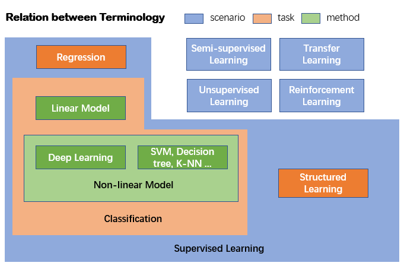
### Supervised learning
* The machine learning task of inferring a function from labeled training data
* Given the "right answer" for each example in the data
* Supervised learning can be further divided into:
1. Regression problem: predict real-valued output
2. Classfication problem
### Unsupervised learning
* Cocktail party problem
* Clustering algorithm
************************
## Linear regression with one variable
### Model representation

Example: Training set(data set) of housing prices

| Size in feet^2 (x) | Price in 1000's (y) |
|:------------------:|:-------------------:|
|        2104        |         460         |
|        1416        |         232         |
|        1534        |         315         |
|        852         |         178         |
|        ...         |         ...         |
a
**Notation:**   
*m = Number of training examples*   
*x's = "input" variable / features*   
*y's = "output" variable / "target" variable*   
* Training set ---> Learning algorithm ---> h(hypothesis)
* Size of house(x) ---> h ---> Estimated price(y)
* h is a function: Linear regression with one variable(Univariable linear regression)
* 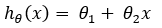
* theta: Parameters
### Cost function
* 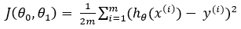
* Also called square error (cost) function
* Goal: 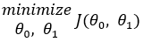
### Gradient descent algorithm
* Repeat until convergence: 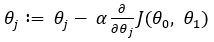
* For j = 1 and j = 0
* alpha: learning rate
* Gradient descent can converge to a local minimum, even with the learning rate alpha fixed
* As we approach a local minimum, gradient descent will automatically take samller steps. So, no need to decrease alpha over time.
### Gradient descent for linear regression
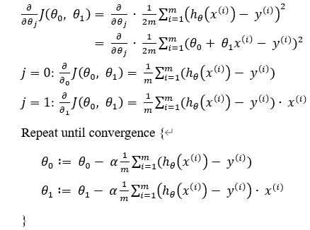
******************************
## Linear Algebra
* Matrix: Rectangular array of numbers
* Dimension of matrix: Number of row x number of columns
* Vector: An n x 1 matrix
******************************
## Linear regression with multiple variables
### Multiple features

| Size(feet^2) (x1) | Number of bedrooms (x2) | Number of floors (x3) | Age of home(years) (x4) | Price($1000) (y) |
|:-----------------:|:-----------------------:|:---------------------:|:-----------------------:|:----------------:|
|       2104        |            5            |           1           |           45            |       460        |
|       1416        |            3            |           2           |           40            |       232        |
|       1534        |            3            |           2           |           30            |       315        |
|        852        |            2            |           1           |           36            |       178        |
|        ...        |           ...           |          ...          |           ...           |       ...        |

**Notation:**   
*n = Number of features*   
* Hypothesis: 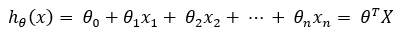
### Gradient descent for multiple variables
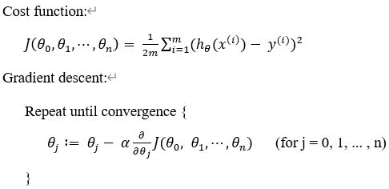
### Some tricks in gradient descent
1. Feature scaling
* Idea: Make sure featrues are on a similar scale
* Get every featrues into approximately a **-1 <= x <= 1** range
2. Mean normalization
* Replace **x** with **x - u** to male featrues have approximately zero mean
3. Learning rate
* Too samll: slow to convergence
* Too large: may decrease on every iteration; may not converge
### Featrues and polynomial regression
### Normal equation
* Method to solve for theta analytically
* No need to featrue scaling

|         Gradient Descent          |        Normal Equation         |
|:---------------------------------:|:------------------------------:|
|       Need to choose alpha        |    No need to choose alpha     |
|       Need many iterations        |     Don't need to iterate      |
| Works well even when *n* is large | Need to compute *(X^T * X)^-1* |
|                                   |   Slow if *n* is very large    |

### Normal equation and non-invertibility(optimal)
*********************************
## Logistic regression
### Classification
### Hypothesis regression
* Want *0 <= h(x) <= 1*
* Sigmoid function(Logistic function): 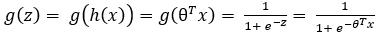
### Decision boundary
### Cost function
* Logistic regression cost function: 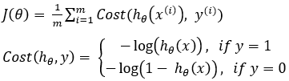
### Simpilified cost function and gradient descent
* Cost function: 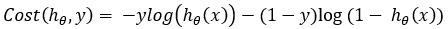
* Gradient descent: 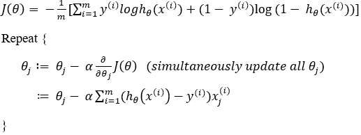
*********************************************
*********************************************
# Machine Learning(Part.2)
